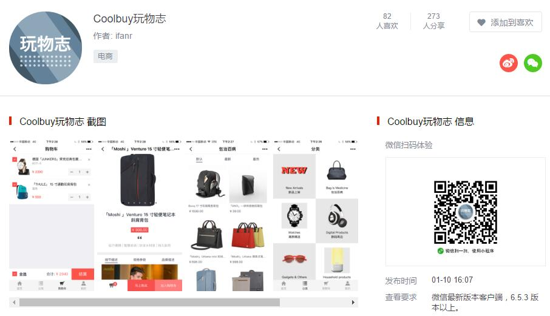
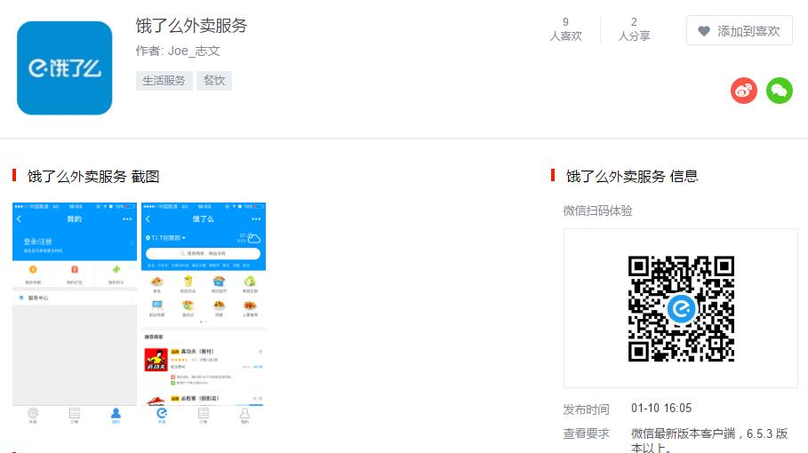
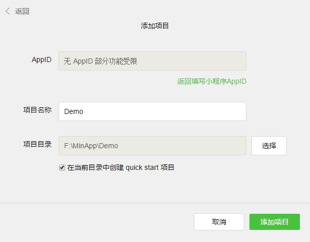
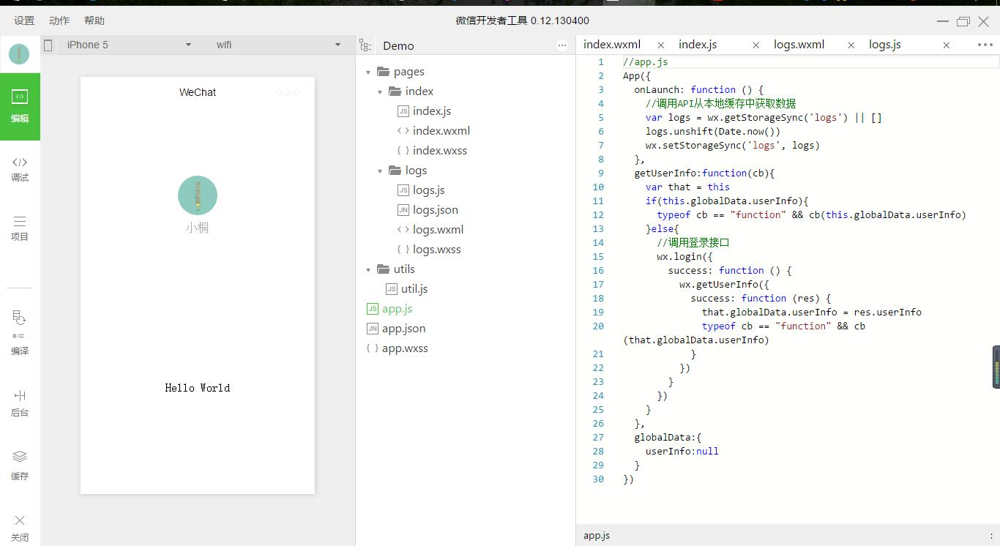
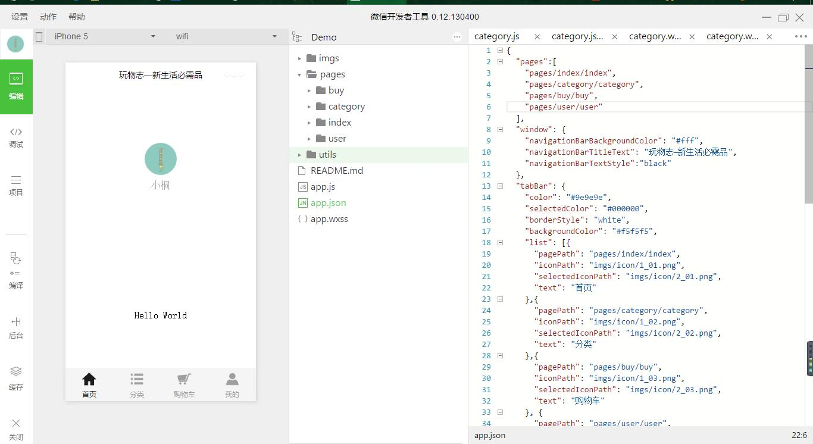

# 小程序

## 一些准备工作

### 官方开发工具

>  https://mp.weixin.qq.com/debug/wxadoc/dev/devtools/download.html?t=201715

### 官方文档

> https://mp.weixin.qq.com/debug/wxadoc/dev/?t=201715

### 官方Demo

> https://mp.weixin.qq.com/debug/wxadoc/dev/demo.html?t=201715
>
> 官方Demo下载后解压到文件夹，在开发工具中新建项目，填写信息，指定路径为解压的文件夹即可查看

### 推荐一些优秀的小程序

> 这两款是目前我看到的做的十分不错的小程序，最大限度的接近原生App的效果，功能也是十分全面，所以在这里推荐大家体验一下
> 
>
> 

## 构建自己的第一个小程序

官方构建工具装好之后扫码登录微信 ，选择调试类型，这里选择本地小程序项目，即可添加自己的小程序项目。

### 新建小程序项目

- 点击添加项目 -->  填写AppID(没有可以选择无AppID)  -->  填写项目名称  -->  选择项目目录(新项目路径选择一个空的文件夹)，此时项目目录下方会出现一个创建quick start项目的选项，这里可以快速帮你构建一个项目的完整目录，不建议取消勾选。确认无误就可以添加项目了。 

  


- 此时你会看到开发者工具已经帮你建好了一些目录并有了一个简单的页面，我们先来梳理一下小程序的路径。

  

  ```
  ├───app.js				// 小程序逻辑
  ├───app.json				// 小程序公共设置
  ├───app.wxss				// 小程序公共样式
  ├───utils					// 用来放置工具类js文件
  │   └───utils.js		  // 工具类js
  └───pages					// 项目页面开发目录，里面的每个子目录代表一个独立页面
      ├───index				// index 页面目录
      │   ├───index.js	  // index 页面逻辑
      │  	├───index.wxml	  // index 页面结构
      │  	└───index.wxss	  // index 页面样式表
      └───logs				// logs 页面目录
      	├───logs.js			// logs 页面逻辑
      	├───logs.json		// logs 页面设置
      	├───logs.wxml		// logs 页面结构
      	└───logs.wxss		// logs 页面样式表
  ```


- 分析目录不难看出小程序的结构十分清晰，根目录下文件构建项目整个外部框架，里面的每个页面都建立在pages的目录下，而常用逻辑可以抽出来放在utils实现代码复用，提高编码效率。然而这个目录并不能满足我们的需求，所以要先按照自己的需求对这个目录进行简单修改。这里我以“玩物志”的小程序为例，对目录先进行处理。

  ```
  ├───app.js				// 小程序逻辑
  ├───app.json				// 小程序公共设置
  ├───app.wxss				// 小程序公共样式
  ├───imgs					// 用来放置小程序中的图片及icon
  ├───utils					// 用来放置工具类js文件
  │   └───utils.js		  // 工具类js
  └───pages					// 项目页面开发目录，里面的每个子目录代表一个独立页面
      ├───index				// index 页面目录
      │   ├───index.js	  // index 页面逻辑
      │  	├───index.wxml	  // index 页面结构
      │  	└───index.wxss	  // index 页面样式表
      ├───category			// 这里按四个主页面建立四个文件夹
      ├───buy				// 每个文件夹中都包含与文件夹同名的wxml,wxss,js,json四个文件
      └───user
  ```

- 在pages中建立的页面都需要在根目录下的app.json文件中进行声明。这里要注意几点：

  > 1. 数组的第一项代表小程序的初始页面
  >
  > 2. 小程序中新增/减少页面，都需要对 pages 数组进行修改，特别的，如果减少页面但是未修改pages的数组，编译会抛出异常
  >
  > 3. 在这里修改数组后框架会自行去寻找路径中的文件，如果路径中的json文件内容为空的话，会抛出异常
  >      ```
  >    Expecting 'STRING','NUMBER','NULL','TRUE','FALSE','{','[', got EOF
  >        | ^
  >      ```
  > 4. 同样的，路径中js为空也会抛出“Page调用异常”的错误，所以要在js中加入“Page({})”
  >


  ```
  "pages":[
    "pages/index/index",
    "pages/category/category",
    "pages/buy/buy",
    "pages/user/user"
  ],
  ```

- 在开始我们的代码之前，先对整个小程序做全局配置，当然，所有的配置代码都在app.json中。这里可以参照官方给出的Api文档对小程序做全局配置。https://mp.weixin.qq.com/debug/wxadoc/dev/framework/config.html?t=201715

  > 注意：json文件中不要写任何的注释，否则在编译过程中会抛出异常
  >
  > 另：window的样式会随着微信内部样式的变化而变化

  ```
  "window": {
      "navigationBarBackgroundColor": "#fff",
      "navigationBarTitleText": "玩物志—新生活必需品",
      "navigationBarTextStyle":"black"
    },
    "tabBar": {
      "selectedColor": "#000",
      "borderStyle": "white",
      "backgroundColor": "#f5f5f5",
      "list": [{
        "pagePath": "pages/index/index",
        "iconPath": "imgs/icon/1_01.png",
        "selectedIconPath": "imgs/icon/2_01.png",
        "text": "首页"
      },{
        "pagePath": "pages/category/category",
        "iconPath": "imgs/icon/1_02.png",
        "selectedIconPath": "imgs/icon/2_02.png",
        "text": "分类"
      },{
        "pagePath": "pages/buy/buy",
        "iconPath": "imgs/icon/1_03.png",
        "selectedIconPath": "imgs/icon/2_03.png",
        "text": "购物车"
      }, {
        "pagePath": "pages/user/user",
        "iconPath": "imgs/icon/1_04.png",
        "selectedIconPath": "imgs/icon/2_04.png",
        "text": "我的"
      }]
    },
  ```

- json文件配置好之后保存一下，左侧的页面会自动刷新，便于开发者调试。

  


### 开始正式编写小程序

#### 顶部导航栏

- 在这里我花费了很多时间，官方文档中提供了一个 navigator 作为导航，但试了下发现这个只能相当于html的a标签，其提供的参数并不能满足我们的需求(页面需求为顶部导航栏点击页面数据刷新，并非页面跳转)，因为在小程序的逻辑中，除了之前在 app.json  "tabBar" 中声明的页面之外，其他页面的跳转都会覆盖到底部导航栏。后来我决定使用wx:if条件渲染来做数据的显示和隐藏。

- 先做导航栏，最开始受到 Vue 的影响，试图使用类似于 :class 这样的代码来做点击的效果，然而官方并没有这个 Api，唯一的一个 wx:if 控制的是整个模块，所以后来采用曲线救国的方式倒也是成功了。

  代码如下：

  ```
  //==========index.wxml============//
  <view class="index_nav">
    <view wx:for="{{nav}}" id="{{index}}" class="nav_text" bindtap="indexNav">
      <text>{{item.title}}</text>
      <view wx:if="{{tap == index}}" id="{{index}}" class="choosed"></view>
    </view>
  </view>
  //============index.js=============//
  Page({
    data: {
      nav: [{
        title: "首页"
      },{
        title: "最新"
      },{
        title: "最热"
      }],
      tap: 0
    },
    //事件处理函数
    indexNav: function (e) {
      this.setData({
        tap: e.currentTarget.id
      });
    }
  })
  ```


- js这里也和Vue有挺大的出入，在逻辑中，this代表page，所以如果想要获取data中的数据，需要this.data.nav。如果这里直接使用this.data.nav可以改变nav的值，但是不会将数据发送到视图层，即页面不会随着数据的变化而改变，所以这里需要用到另外的函数this.setData()实时改变页面状态，保持视图层和逻辑层的数据一致。

- 其次在使用 “ wx:for ” 循环的时候，开发者工具会给出一个警告 “Now you can provide attr "wx:key" for a "wx:for" to improve performance.” ，关于这个 “ wx:key ” 官方API有详细说明，这里不多做解释，但是提醒一下，不恰当的使用 wx:key 会有不好的影响。

  https://mp.weixin.qq.com/debug/wxadoc/dev/framework/view/wxml/list.html?t=2017112

#### Banner轮播图

Banner图在小程序中是比较好处理的，官方给出的 swiper 组件基本就能满足我们的需求。

```
<swiper class="index_swiper" indicator-dots="true" autoplay="true" >
    <swiper-item wx:for="{{banner}}">
      <navigator url="{{item.url}}">
        <image class="swiper_image" src="{{item.image}}"></image>
      </navigator>
    </swiper-item>
  </swiper>
```
这里有几点需要特别注意：

1. swpier自带很多属性，这些属性大都有一个默认值，在使用前要多参照官方Api文档熟悉这些属性的默认值；

2. Banner图尽量使用在线图片，因为小程序的代码有1M的大小限制，大量图片会占用过多的空间；

3. swiper组件官方默认有一个 " display: block; height: 150px; "  的样式，大多情况下我们都需要在wxss中根据自己的需要重置这个样式；

4. image组件也同样有一个如下的默认样式，这里也需要根据需求手动重置。

   > ```
   > image {
   > width:320px;
   > height:240px;
   > display:inline-block;
   > overflow:hidden;
   > }
   > ```


#### 主页其他部分

再往下的部分只是一些简单的静态部分，而且这里wxss的语法同css语法一致，有前端开发经验的一定不陌生，把页面排列整齐美观即可，所用到的大都是view，text，image，navigator这些，小程序并没有给出前端常见的ul li 所以这里一般都是直接使用 view 标签 wx:for  循环。前端开发人员一定对base.css不会陌生，小程序这里如果想要定义全局默认样式，可以在根目录的app.wxss中定义：

```
view,text {
  font-family: "微软雅黑";
  font-size: 24rpx;
  color: #999;
}
```