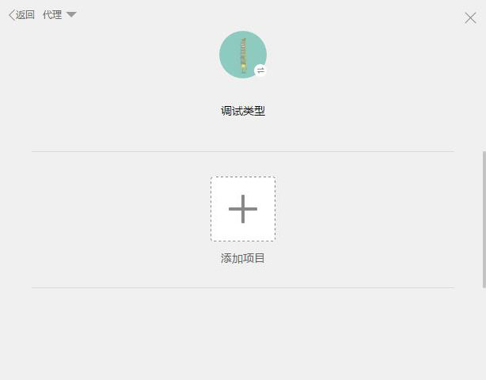
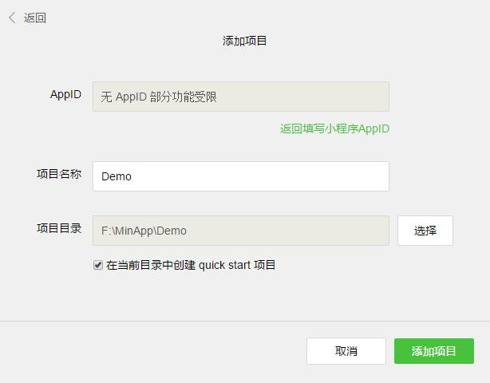

# 小程序

## 一些准备工作

### 官方开发工具

>  https://mp.weixin.qq.com/debug/wxadoc/dev/devtools/download.html?t=201715

### 官方文档

> https://mp.weixin.qq.com/debug/wxadoc/dev/?t=201715

### 官方Demo

> https://mp.weixin.qq.com/debug/wxadoc/dev/demo.html?t=201715
>
> 官方Demo下载后解压到文件夹，在开发工具中新建项目，填写信息，指定路径为解压的文件夹即可查看

### 推荐一些优秀的小程序

> 这两款是目前我看到的做的十分不错的小程序，最大限度的接近原生App的效果，功能也是十分全面，所以在这里推荐大家体验一下
> 
>
> 

## 构建自己的第一个小程序

官方构建工具装好之后扫码登录微信 ，选择调试类型，这里选择本地小程序项目，即可添加自己的小程序项目。

### 新建小程序项目

- 点击添加项目 -->  填写AppID(AppID可在公众号中找到，没有可以选择无AppID)  -->  填写项目名称  -->  选择项目目录(新项目路径选择一个空的文件夹)，此时项目目录下方会出现一个创建quick start项目的选项，这里可以快速帮你构建一个项目的完整目录，不建议取消勾选。确认无误就可以添加项目了。
    

   


- 此时你会看到开发者工具已经帮你建好了一些目录并有了一个简单的页面，我们先来梳理一下小程序的路径。

  

  ```
  ├───app.js				// 小程序逻辑
  ├───app.json				// 小程序公共设置
  ├───app.wxss				// 小程序公共样式
  ├───utils					// 用来放置工具类js文件
  │   └───utils.js		  // 工具类js
  └───pages					// 项目页面开发目录，里面的每个子目录代表一个独立页面
      ├───index				// index 页面目录
      │   ├───index.js	  // index 页面逻辑
      │  	├───index.wxml	  // index 页面结构
      │  	└───index.wxss	  // index 页面样式表
      └───logs				// logs 页面目录
      	├───logs.js			// logs 页面逻辑
      	├───logs.json		// logs 页面设置
      	├───logs.wxml		// logs 页面结构
      	└───logs.wxss		// logs 页面样式表
  ```


- 分析目录不难看出小程序的结构十分清晰，根目录下文件构建项目整个外部框架，里面的每个页面都建立在pages的目录下，而常用逻辑可以抽出来放在utils实现代码复用，提高编码效率。然而这个目录并不能满足当前我们的需求，那么我们对这个目录进行简单修改。

